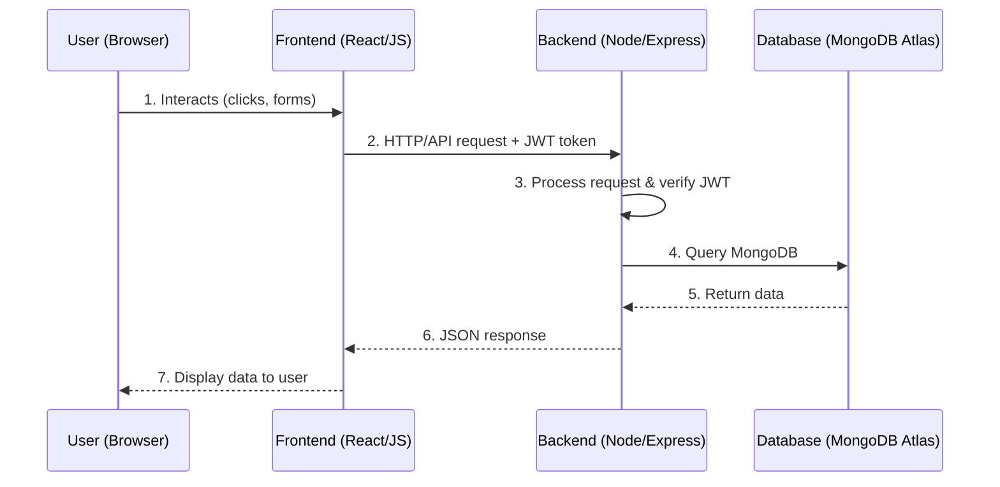

# NSLingo — Technical & Product Specification

> **Tagline:** *"Don't Blur. Learn NS Before NS."*

---

## Overview

**NSLingo** is a Duolingo-style, responsive web application that teaches Singapore
National Service (NS) slang, acronyms, and terminology through bite-sized lessons
and scenario-based quizzes.

| | |
|---|---|
| **Product type** | Responsive web app (Duolingo-style) |
| **Domain** | Singapore National Service (NS) language & terminology |
| **Target users** | Pre-enlistment recruits who want to understand NS lingo before booking in |
| **Core value** | Learn NS slang, acronyms, and terms via short lessons and real-scenario quizzes |
| **Tagline** | "Don't Blur. Learn NS Before NS." |

---

## Tech Stack

| Layer | Technology | Hosting |
|---|---|---|
| Frontend (Presentation) | React, JavaScript, HTML/CSS, Bootstrap | Vercel |
| Backend (Application) | Node.js, Express | Render |
| Database (Storage) | MongoDB Atlas | MongoDB Atlas (cloud) |
| Authentication | JWT (JSON Web Tokens) | — |

---

## Architecture (Three-Tier)

### 1. Frontend — Presentation Layer

- **Tech:** React, JavaScript, HTML/CSS + Bootstrap.
- **Hosting:** Vercel.
- **Responsibilities:**
  - React components render the application's pages.
  - JavaScript handles button clicks, form submissions, and API calls.
  - HTML/CSS + Bootstrap handle layout and styling (responsive design).
  - Sends HTTP/API requests to the backend, attaching a **JWT token** for
    authentication.
  - Displays returned data to the user.

### 2. Backend — Application Layer

- **Tech:** Node.js + Express.
- **Hosting:** Render.
- **Responsibilities:**
  - Exposes API routes (see [API Endpoints](#api-endpoints)).
  - JWT middleware verifies user tokens on protected routes.
  - Processes requests and queries the database.
  - Returns **JSON** responses to the frontend.

### 3. Database — Storage Layer

- **Tech:** MongoDB Atlas.
- **Responsibilities — stores:**
  - NS slang **dictionary terms**.
  - **Quiz questions and answers**.
  - **Translation examples**.
  - **User progress** (e.g. NS readiness %, badges earned, streaks).

---

## Data Flow



**Numbered steps:**

1. User (browser) interacts with the Frontend (React/JS).
2. Frontend sends an HTTP/API request with a JWT token to the Backend.
3. Backend processes the request and verifies the JWT.
4. Backend queries MongoDB.
5. Database returns the requested data.
6. Backend sends a JSON response to the Frontend.
7. Frontend displays the data to the user.

---

## API Endpoints

| Method | Route | Auth Required | Description |
|---|---|---|---|
| `GET` | `/dictionary` | TBD | Retrieve NS slang dictionary terms. |
| `POST` | `/translate` | TBD | Translate NS speak into plain English. |
| `GET` | `/quiz` | TBD | Retrieve quiz questions and answers. |
| `GET` | `/progress` | Yes (JWT) | Retrieve the user's progress data. |

> JWT middleware verifies user tokens on protected routes. Exact per-route auth
> requirements beyond `/progress` are **TBD**.

---

## Data Models

> MongoDB Atlas collections. Field-level schemas are **TBD**; the following are the
> key fields implied by the specification.

### `dictionaryTerms`
- NS slang term
- Meaning
- Example(s)

### `quizQuestions`
- Question (scenario-framed)
- Answer options
- Correct answer
- Feedback

### `translationExamples`
- NS speak input
- Plain-English output
- Detected NS terms

### `userProgress`
- NS readiness %
- Badges earned
- Streaks
- Modules completed
- Perfect scores
- Weekly activity
- Per-module progress

---

## Feature List

### Onboarding
- **Landing page** → introduces NSLingo.
- **Set Goals** → choose a daily commitment: **Casual / Regular / Serious**.
- **"How NSLingo Works"** → **Learn → Test → Earn**.
- **"Ready to Book In" summary** → overview of lessons, daily streaks, translator,
  and badges.

### Core Learning
- **Dashboard — Learning Path:** progressive modules, each with XP and a progress
  bar; later modules locked until earlier ones are completed.

  | Module | Notes |
  |---|---|
  | Basic Commands | Entry module |
  | Rank & Structure | |
  | Common Phrases | |
  | Equipment Terms | |
  | Exercise Lingo | |
  | Admin Speak | |

- **Lesson Card:** lesson units (e.g. *Attention & Parade Rest*), pro tips, XP
  rewards, and progress tracking; leads into a practice quiz.
- **Scenario Quiz:** multiple-choice questions framed as real NS scenarios (e.g.
  *"Your sergeant shouts: 'Later kenna tekan!'"*) with instant feedback.
- **Results Screen:** score (e.g. 2/3, % correct), XP earned, star rating, and badge.

### Tools
- **Glossary:** searchable, A–Z list of NS terms with meanings and examples.
- **NS Translator:** converts NS speak into plain English, highlighting detected NS
  terms; includes worked examples.

### Profile
- **Profile (NS Recruit):** NS readiness %, modules completed, current streak,
  perfect scores, weekly activity chart, achievements/badges, and per-module
  progress.

---

## Design System — `styles.css`

> Derived from the wireframe legend and screen styling. Implemented as CSS custom
> properties layered on top of Bootstrap so utility classes and components share one
> palette. Drop this in a global `styles.css` imported once at the app root.

### Colour Palette (from the wireframe legend)

| Token | Role | Hex |
|---|---|---|
| Emerald green | **Primary** brand colour — actions, headers, primary buttons | `#10b981` |
| Emerald (dark) | Hover/active state for primary, dark green navbar | `#059669` |
| Emerald (tint) | Card backgrounds, progress fills, "correct" feedback | `#d1fae5` |
| Blue | **NS Translator** accent (header, translate button) | `#2563eb` |
| Purple | **NS Recruit / Profile** accent (header, badges) | `#7c3aed` |
| Amber | **Unlocked** badges & achievement elements | `#f59e0b` |
| Ink | Primary text | `#0f172a` |
| Muted | Secondary text, captions | `#64748b` |
| Surface | Page background | `#f8fafc` |
| Card | Card/surface background | `#ffffff` |
| Border | Hairlines, dividers, locked states | `#e2e8f0` |

### CSS

```css
/* ===== Design Tokens ===== */
:root {
  /* Brand */
  --ns-primary:        #10b981;  /* emerald — actions, headers */
  --ns-primary-dark:   #059669;  /* hover/active, dark navbar */
  --ns-primary-tint:   #d1fae5;  /* card bg, progress, correct */

  /* Accents (per-section) */
  --ns-translator:     #2563eb;  /* blue  — NS Translator */
  --ns-recruit:        #7c3aed;  /* purple — NS Recruit / Profile */
  --ns-badge:          #f59e0b;  /* amber — unlocked achievements */

  /* Neutrals */
  --ns-ink:            #0f172a;
  --ns-muted:          #64748b;
  --ns-surface:        #f8fafc;
  --ns-card:           #ffffff;
  --ns-border:         #e2e8f0;

  /* Shape & motion */
  --ns-radius:         12px;
  --ns-radius-pill:    999px;
  --ns-shadow-sm:      0 1px 2px rgba(15, 23, 42, 0.06);
  --ns-shadow:         0 4px 16px rgba(15, 23, 42, 0.08);
  --ns-transition:     150ms ease;

  /* Map Bootstrap theme vars onto our palette */
  --bs-primary:        var(--ns-primary);
  --bs-body-bg:        var(--ns-surface);
  --bs-body-color:     var(--ns-ink);
  --bs-border-color:   var(--ns-border);
}

/* ===== Base ===== */
body {
  background: var(--ns-surface);
  color: var(--ns-ink);
  font-family: "Inter", system-ui, -apple-system, "Segoe UI", sans-serif;
}

/* ===== Buttons ===== */
.btn-primary {
  --bs-btn-bg:           var(--ns-primary);
  --bs-btn-border-color: var(--ns-primary);
  --bs-btn-hover-bg:     var(--ns-primary-dark);
  --bs-btn-hover-border-color: var(--ns-primary-dark);
  --bs-btn-active-bg:    var(--ns-primary-dark);
  border-radius: var(--ns-radius-pill);
  font-weight: 600;
}

/* ===== Cards ===== */
.ns-card {
  background: var(--ns-card);
  border: 1px solid var(--ns-border);
  border-radius: var(--ns-radius);
  box-shadow: var(--ns-shadow-sm);
  transition: box-shadow var(--ns-transition);
}
.ns-card:hover { box-shadow: var(--ns-shadow); }

/* ===== Progress bars (learning path) ===== */
.progress { background: var(--ns-border); border-radius: var(--ns-radius-pill); }
.progress-bar { background: var(--ns-primary); }

/* ===== Per-section accent themes ===== */
/* Add the modifier class to the page/header wrapper to re-theme accents. */
.theme-translator { --ns-primary: var(--ns-translator); --ns-primary-dark: #1d4ed8; }
.theme-recruit    { --ns-primary: var(--ns-recruit);    --ns-primary-dark: #6d28d9; }

/* ===== Quiz feedback ===== */
.ns-feedback--correct {
  background: var(--ns-primary-tint);
  border: 1px solid var(--ns-primary);
  color: var(--ns-primary-dark);
}

/* ===== Locked / disabled modules ===== */
.ns-locked { opacity: 0.5; pointer-events: none; }
```

---

## Navbar

NSLingo uses **two navbars** plus a **dashboard sidebar**, switched by route.

### 1. Marketing / Onboarding navbar (light)

Shown on the Landing and Onboarding screens. White bar, `NSLingo` wordmark on the
left, lesson links in the centre, emerald **GET STARTED** pill on the right. On the
onboarding steps the centre links are replaced by a 3-dot **stepper**.

```jsx
<nav className="navbar navbar-expand-lg ns-navbar ns-navbar--light">
  <div className="container">
    <a className="navbar-brand ns-brand" href="/">NSLingo</a>

    <ul className="navbar-nav mx-auto">
      <li className="nav-item"><a className="nav-link" href="/lessons">Lessons</a></li>
      <li className="nav-item"><a className="nav-link" href="/glossary">Glossary</a></li>
      <li className="nav-item"><a className="nav-link" href="/translator">Translator</a></li>
    </ul>

    <a className="btn btn-primary" href="/onboarding">GET STARTED</a>
  </div>
</nav>
```

### 2. App navbar (dark emerald)

Shown once the user is in the app (Dashboard, Lesson, Quiz, Tools). Dark emerald bar
with the wordmark left and **status chips** + **profile avatar** on the right:
`🔥 5 day streak` · `🎯 30% NS Readiness` · avatar.

```jsx
<nav className="navbar ns-navbar ns-navbar--app">
  <div className="container-fluid">
    <a className="navbar-brand ns-brand text-white" href="/dashboard">NSLingo</a>

    <div className="d-flex align-items-center gap-3">
      <span className="ns-chip">🔥 5 day streak</span>
      <span className="ns-chip">🎯 30% NS Readiness</span>
      <a href="/profile" className="ns-avatar" aria-label="Profile" />
    </div>
  </div>
</nav>
```

### 3. Dashboard sidebar (left rail)

Vertical nav inside the app shell: **Home · Learn · Translator · Glossary ·
Achievements · Profile**. The active item is emerald-filled; others are muted.

```jsx
<aside className="ns-sidebar">
  <NavLink to="/dashboard"    className="ns-sidebar__link">🏠 Home</NavLink>
  <NavLink to="/learn"        className="ns-sidebar__link">📘 Learn</NavLink>
  <NavLink to="/translator"   className="ns-sidebar__link">🌐 Translator</NavLink>
  <NavLink to="/glossary"     className="ns-sidebar__link">📖 Glossary</NavLink>
  <NavLink to="/achievements" className="ns-sidebar__link">🏆 Achievements</NavLink>
  <NavLink to="/profile"      className="ns-sidebar__link">👤 Profile</NavLink>
</aside>
```

### Navbar CSS

```css
/* Shared */
.ns-navbar { box-shadow: var(--ns-shadow-sm); }
.ns-brand  { font-weight: 800; letter-spacing: -0.02em; }

/* Light (marketing/onboarding) */
.ns-navbar--light { background: var(--ns-card); border-bottom: 1px solid var(--ns-border); }
.ns-navbar--light .nav-link { color: var(--ns-muted); font-weight: 500; }
.ns-navbar--light .nav-link:hover,
.ns-navbar--light .nav-link.active { color: var(--ns-primary); }

/* App (dark emerald) */
.ns-navbar--app { background: var(--ns-primary-dark); }
.ns-navbar--app .ns-brand { color: #fff; }
.ns-chip {
  display: inline-flex; align-items: center; gap: .35rem;
  padding: .25rem .65rem; border-radius: var(--ns-radius-pill);
  background: rgba(255, 255, 255, 0.15); color: #fff; font-size: .8rem; font-weight: 600;
}
.ns-avatar {
  width: 32px; height: 32px; border-radius: 50%;
  background: var(--ns-primary-tint); border: 2px solid #fff; display: inline-block;
}

/* Sidebar */
.ns-sidebar { display: flex; flex-direction: column; gap: .25rem; padding: 1rem; }
.ns-sidebar__link {
  display: flex; align-items: center; gap: .6rem;
  padding: .55rem .75rem; border-radius: var(--ns-radius);
  color: var(--ns-muted); text-decoration: none; font-weight: 500;
  transition: background var(--ns-transition), color var(--ns-transition);
}
.ns-sidebar__link:hover { background: var(--ns-surface); color: var(--ns-ink); }
.ns-sidebar__link.active { background: var(--ns-primary-tint); color: var(--ns-primary-dark); }
```

> **Per-section theming:** the Translator screen wraps its header in
> `.theme-translator` (blue) and the Profile/Recruit screen in `.theme-recruit`
> (purple); both override `--ns-primary` so buttons, chips, and active states pick up
> the section accent without duplicating component CSS.

---

## Future Considerations / TBD

- Per-route authentication requirements beyond `/progress` (`/dictionary`,
  `/translate`, `/quiz`).
- Detailed field-level schemas for all MongoDB collections.
- User authentication/registration flow (login, sign-up, token issuance).
- XP-to-readiness and star-rating calculation logic.
- Badge catalogue and unlock criteria.
- Module unlock/locking rules (exact completion thresholds).
